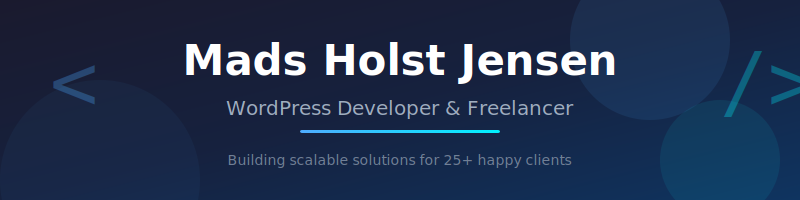

  

  

  
  
  

---

## 👋 About Me

I build custom WordPress solutions with a focus on performance, scalability, and user experience. With a background in Global Business Informatics (IT University of Copenhagen), I combine technical expertise with business acumen.

Currently running [mahope.dk](https://mahope.dk) full-time, serving 25+ clients while exploring SaaS development and self-hosted infrastructure.

---

## 🏆 Trusted By

  
  &nbsp;&nbsp;&nbsp;&nbsp;&nbsp;&nbsp;
  
  &nbsp;&nbsp;&nbsp;&nbsp;&nbsp;&nbsp;
  

---

## 🛠️ Tech Stack

### Daily Drivers

### Frontend

### Infrastructure & DevOps

### Tools & Workflow

---

## 🚀 Featured Projects

<table>
  <tr>
    <td width="50%">
      <h3 align="center">Annas Højskole</h3>
      

        
      

      
Complete website rebuild with custom booking system, course management, and modern design using Breakdance Builder.

      

        
        
        
      

    </td>
    <td width="50%">
      <h3 align="center">PlastSurgeon.com</h3>
      

        
      

      
Medical practice website with advanced WooCommerce integration, appointment scheduling, and GDPR compliance.

      

        
        
        
      

    </td>
  </tr>
</table>

  

---

## 📊 GitHub Activity

  

  
  

<picture>
  <source media="(prefers-color-scheme: dark)" srcset="https://raw.githubusercontent.com/mahope/mahope/output/github-contribution-grid-snake-dark.svg" />
  <source media="(prefers-color-scheme: light)" srcset="https://raw.githubusercontent.com/mahope/mahope/output/github-contribution-grid-snake.svg" />
  
</picture>

---

## 🎯 What I Do

| Service | Description |
|---------|-------------|
| 🔧 **Custom WordPress Development** | Tailored solutions from theme development to complex plugin integrations |
| 🛒 **WooCommerce Solutions** | Advanced e-commerce setups with custom payment flows and integrations |
| ⚡ **Performance Optimization** | Speed audits, caching strategies, and hosting optimization |
| 🎨 **Page Builder Expertise** | Breakdance, Bricks, and Elementor implementations |
| 🖥️ **Self-Hosted Infrastructure** | Docker-based deployments with Dokploy and Coolify |

---

## 🌱 Currently Exploring

- 💡 SaaS development with modern frameworks
- 📧 Email marketing infrastructure (Listmonk)
- 🖨️ 3D printing projects with Bambu Lab A1
- 📱 Android app development

---

## 📫 Let's Work Together

  

  
  
  

---

## 🧑‍💻 Beyond the Code

I'm a dad of three, married to Tea, and based in Denmark. When I'm not deep in WordPress or tinkering with new tech, you'll find me:

- 🧗 **Bouldering** — My go-to way to clear my head and challenge myself
- ⚜️ **Solaris** — Active in leadership roles in this Danish scouting organization
- 🖨️ **3D Printing** — Currently experimenting with my Bambu Lab A1
- 🌲 **Outdoors** — Exploring nature with family and scouts

I believe in building sustainable businesses, maintaining work-life balance, and continuous personal growth.

---

  

  

