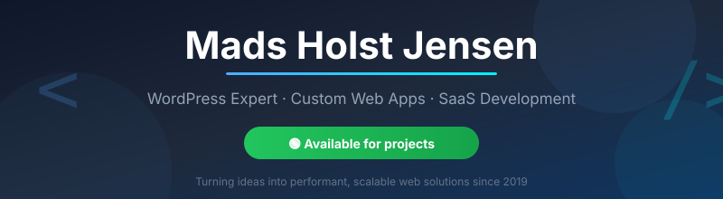

  

  
  &nbsp;
  

  
  
  

---

## 👋 About Me

I build custom WordPress solutions and modern web applications with a focus on performance, scalability, and user experience. With a background in Global Business Informatics (IT University of Copenhagen), I combine technical expertise with business acumen.

Currently running [mahoje.dk](https://mahoje.dk) full-time, serving 25+ clients while building SaaS products and open-source tools.

---

## 💬 What Clients Say

> *"Mads delivered a complete website rebuild with a custom booking system and course management — on time and with excellent communication throughout."*
> — **Annas Højskole**

> *"Professional, fast, and deeply knowledgeable. Mads built our international learning platform with complex LMS integration and multi-language support."*
> — **PlastSurgeon.com**

> *"Mads optimized our WooCommerce store and handles ongoing maintenance. Our site is faster, more secure, and easier to manage."*
> — **Indretning med Planter**

---

## 🏆 Trusted By

  
  &nbsp;&nbsp;&nbsp;&nbsp;&nbsp;&nbsp;
  
  &nbsp;&nbsp;&nbsp;&nbsp;&nbsp;&nbsp;
  

---

## 🎯 How I Can Help You

<table>
  <tr>
    <td align="center" width="33%">
      <h3>🔧 WordPress</h3>
      
Need a fast, secure, and scalable WordPress site? From custom themes and plugins to WooCommerce, Bricks Builder, and performance optimization.

      
    </td>
    <td align="center" width="33%">
      <h3>🚀 Custom Web Apps</h3>
      
Need a custom SaaS product, dashboard, or web application? Full-stack development with Next.js, React, TypeScript, Stripe, and modern APIs.

      
    </td>
    <td align="center" width="33%">
      <h3>⚡ Performance Audit</h3>
      
Is your site slow? Get a free audit with actionable recommendations for speed, SEO, Core Web Vitals, and security improvements.

      
    </td>
  </tr>
</table>

---

## 🛠️ Tech Stack

### Daily Drivers

### Frontend & Frameworks

### Infrastructure & DevOps

### Tools & Workflow

---

## 🚀 Featured Projects

<table>
  <tr>
    <td width="50%">
      <h3 align="center">TimeTrack.dk</h3>
      

        
      

      
SaaS time tracking application with Stripe payments, team management, and reporting.

      

        
        
        
      

    </td>
    <td width="50%">
      <h3 align="center">Dash</h3>
      

        
      

      
Custom developer dashboard and workspace manager for Windows. Electron, TypeScript, React, Tailwind CSS.

      

        
        
        
      

    </td>
  </tr>
  <tr>
    <td width="50%">
      <h3 align="center">Annas Højskole</h3>
      

        
      

      
Complete website rebuild with custom booking system, course management, and modern design using Bricks Builder.

      

        
        
        
      

    </td>
    <td width="50%">
      <h3 align="center">PlastSurgeon.com</h3>
      

        
      

      
International learning platform for plastic surgeons with handbook, courses, case competition, and member system.

      

        
        
        
      

    </td>
  </tr>
  <tr>
    <td width="50%">
      <h3 align="center">Dictation App</h3>
      

        
      

      
Dictate and transcribe speech into any input field on your system. Lightweight, fast, and always available.

      

        
        
      

    </td>
    <td width="50%">
      <h3 align="center">QRtool.dk</h3>
      

        
      

      
Free QR code generator with WiFi, vCard, and batch support. Open source.

      

        
        
        
      

    </td>
  </tr>
</table>

  

---

## 🔓 Open Source

| Project | Description |
|---------|-------------|
| [**QRtool.dk**](https://github.com/mahope/qrtool) | Free QR code generator with WiFi, vCard, and batch support |
| [**Kort**](https://github.com/mahope/kort) | Print Danish topographic maps as PDF — vector tiles from Dataforsyningen |
| [**Bouldering Lingo**](https://github.com/mahope/bouldering-lingo) | Interactive flashcards for climbing terms 🧗 |
| [**Beregner.dk**](https://github.com/mahope/beregner-dk) | Collection of Danish calculators and converters |
| [**Samtale Spil**](https://github.com/mahope/samtale-spil) | Conversation game for couples, families, and friends |
| [**Lifespan Calculator**](https://github.com/mahope/lifespan-calculator) | Interactive Danish lifespan calculator with fun facts |
| [**MBTI Test**](https://github.com/mahope/mbti-test) | MBTI personality test webapp for young scouts |
| [**Dash**](https://github.com/mahope/dash-windows) | Custom developer dashboard and workspace manager for Windows |
| [**Dictation App**](https://github.com/mahope/dictation-app) | Dictate and transcribe into any input field |

---

## 📊 GitHub Activity

  

  

  
  

  
  

<picture>
  <source media="(prefers-color-scheme: dark)" srcset="https://raw.githubusercontent.com/mahope/mahope/output/github-contribution-grid-snake-dark.svg" />
  <source media="(prefers-color-scheme: light)" srcset="https://raw.githubusercontent.com/mahope/mahope/output/github-contribution-grid-snake.svg" />
  
</picture>

---

## 🌱 Currently Building

- ⏱️ **TimeTrack.dk** — SaaS time tracking with Stripe billing
- 🖥️ **Dash** — Custom developer dashboard and workspace manager
- 🎙️ **Dictation App** — System-wide speech-to-text input tool
- 🗺️ **Kort** — Danish topographic map printer with vector tiles

---

## 🧑‍💻 Beyond the Code

I'm a dad of three, married to Tea, and based in Denmark. When I'm not deep in WordPress or tinkering with new tech, you'll find me:

- 🧗 **Bouldering** — My go-to way to clear my head and challenge myself
- ⚜️ **Solaris** — Active in leadership roles in this Danish scouting organization
- 🖨️ **3D Printing** — Experimenting with my Bambu Lab A1
- 🌲 **Outdoors** — Exploring nature with family and scouts

I believe in building sustainable businesses, maintaining work-life balance, and continuous personal growth.

---

  <h3 align="center">Ready to build something great?</h3>

  
  &nbsp;
  

  
  
  

---

  

  

